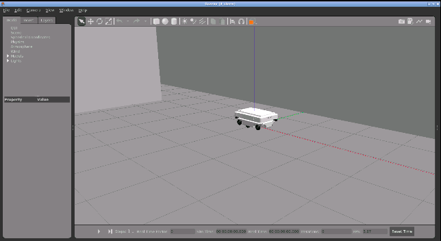
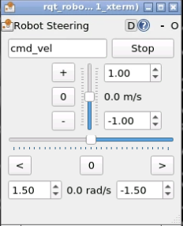

# Checkpoint 3 - Advanced C++ Part 1

C++ ROS node that publishes robot information for a MiR100 mobile robot using **inheritance** and **composition** design patterns. This node serves as the data provider for a teleoperation GUI built in [Checkpoint 4](https://github.com/mathrosas).

Part of the [ROS & ROS 2 Developer Master Class](https://www.theconstructsim.com/) certification (Phase 1).

<p align="center">
  
</p>

## Overview

The project builds a `robot_info` ROS node that publishes robot metadata (description, serial number, IP, firmware, payload capacity, and hydraulic system status) to the `/robot_info` topic using a custom message. This data feeds into a graphical teleoperation interface:

<p align="center">
  
</p>

## Class Architecture

The design demonstrates two core OOP patterns:

### Inheritance

```
RobotInfo (base class)
    │  robot_description, serial_number, ip_address, firmware_version
    │  virtual publish_data()
    │  ROS Publisher → /robot_info
    │
    └── AGVRobotInfo (derived class)
            maximum_payload
            publish_data() override
```

- **`RobotInfo`**: base class holding general robot data (description, serial number, IP, firmware) and a virtual `publish_data()` method with a ROS publisher
- **`AGVRobotInfo`**: derived class adding `maximum_payload` for autonomous ground vehicles, overrides `publish_data()` to include all fields

### Composition

```
AGVRobotInfo
    └── has-a → HydraulicSystemMonitor
                    hydraulic_oil_temperature
                    hydraulic_oil_tank_fill_level
                    hydraulic_oil_pressure
```

- **`HydraulicSystemMonitor`**: composed into `AGVRobotInfo` as a member variable, provides getter methods for three hydraulic system metrics

## Published Message

Custom message `CustomRobotInfo.msg` with 10 string fields:

```
rostopic echo /robot_info
```

```yaml
data_field_01: "robot_description: Mir100"
data_field_02: "serial_number: 567A359"
data_field_03: "ip_address: 169.254.5.180"
data_field_04: "firmware_version: 3.5.8"
data_field_05: "maximum_payload: 100 Kg"
data_field_06: "hydraulic_oil_temperature: 45C"
data_field_07: "hydraulic_oil_tank_fill_level: 100%"
data_field_08: "hydraulic_oil_pressure: 250 bar"
data_field_09:
data_field_10:
```

## Project Structure

```
robot_info/
├── CMakeLists.txt
├── package.xml
├── include/
│   └── robot_info/
│       └── robot_info_class.h            # RobotInfo base class header
├── msg/
│   └── CustomRobotInfo.msg               # Custom 10-field string message
├── src/
│   ├── robot_info_class.cpp              # RobotInfo base class implementation
│   ├── robot_info_main.cpp               # Entry point for robot_info_node
│   ├── agv_robot_info_class.cpp          # AGVRobotInfo derived class + main
│   └── hydraulic_system_monitor.cpp      # HydraulicSystemMonitor class
└── media/
```

## How to Use

### Prerequisites

- ROS Noetic
- `advanced_cpp_auxiliary_pkgs` (provides `robotinfo_msgs` and the MiR100 simulation)

### Build

```bash
cd ~/catkin_ws
catkin_make
source devel/setup.bash
```

### Run the Base Node

```bash
# Terminal 1
roscore

# Terminal 2 - publishes fields 01-04 only
rosrun robot_info robot_info_node

# Terminal 3
rostopic echo /robot_info
```

### Run the AGV Node (Full Output)

```bash
# Terminal 1
roscore

# Terminal 2 - publishes all 8 fields
rosrun robot_info agv_robot_info_node

# Terminal 3
rostopic echo /robot_info
```

### Launch the Simulation

```bash
roslaunch mir_gazebo mir_maze_world.launch

# Unpause physics
rosservice call /gazebo/unpause_physics
```

## Git Tags

| Tag | Description |
|---|---|
| `part1-step1` | Inheritance: `RobotInfo` base + `AGVRobotInfo` derived class |
| `part1-step2` | Composition: `HydraulicSystemMonitor` composed into `AGVRobotInfo` |

## Key Concepts Covered

- **Inheritance**: base/derived class hierarchy with virtual method overriding
- **Composition**: embedding a monitor object as a member variable
- **Custom ROS messages**: defining and building `.msg` files with `catkin`
- **ROS Publishers**: publishing structured data at a fixed rate
- **C++ OOP**: constructors, destructors, access specifiers, `override` keyword

## Technologies

- ROS Noetic
- C++
- Gazebo Classic 11 (MiR100 simulation)
- OpenCV / CVUI (used in Checkpoint 4 for the GUI)
